# An End-To-End Tracker
This the source code of the end-to-end Fast Motion Modeling Network (FMMN) which jointly perform detection and association. Based on this network, we design a tracker. It can accurately tracking mutlple objects in video frames with amazing speed (more than 120 fps). 

> We spend one and half year to make this idea possible. Yes, we finally finish it and publish this tracker along with an Awesome Multiple Object Tracking Dataset ([AMOTD](https://github.com/shijieS/AwesomeMOTDataset)).

## RoadMap

| Date   | Event                                                        |
| ------ | ------------------------------------------------------------ |
| 201908 | Get Result on AMOT dataset                                   |
| 201908 | Can Train on AMOT dataset                                   |
| 201907 | Can Train on MOT17 dataset                                   |
| 201906 | Can Train on ``[CVPR 2019 Tracking Challenge](<https://motchallenge.net/data/CVPR_2019_Tracking_Challenge/#download>)'' |
| 201905 | Can Train On the Whole UA-DETRAC dataset                     |
| 201905 | Design the tracker                                           |
| 201904 | Recording Five Cities Training Dataset                       |
| 201903 | Start A Plan of Create New Dataset                           |
| 201902 | Optimized this network                                       |
| 201812 | Can Do the Basic Detection                                   |
| 201811 | Design the Loss Fucntion                                     |
| 201810 | Try the UA-DETRAC dataset                                    |
| 201809 | Re-design the input and output                               |
| 201808 | Design the whole network                                     |
| 201807 | Start this idea                                              |

<!-- ## Protocol

- bbox: the format is *(left, top, right, bottom)*
- $N_{tr}$: the track number.
- $N_{ba}​$: the batch number.
- $N_{ti}$: the selected frame number
- $N_{pr}$: the number of prior boxes
- $W, H$: the input network image size (W, H).
- $W_{re}, H_{re}$: the real input image size.
- $F_t$: the $t^{th}$ frame
- $N_{fn}$: the input frame number
- $f(\cdot)$ is the operation to convert parameter to bboxes -->

## Network

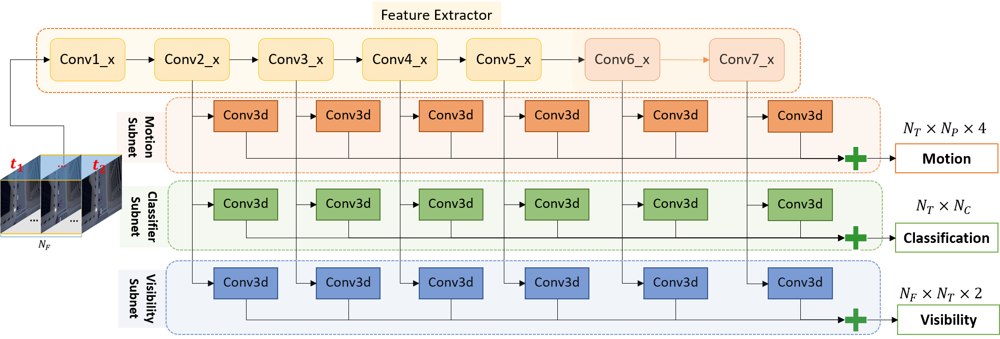
> The framework of the FMMN. The input item is a set of video frames (16 frames in our experiment). We use 3D ResNet and the extended 3D ResNet to extract the spatial-temporal feature maps. These feature maps input into three subnet: Motion Subnet, Classifier Subnet, and Visibility Subnet, in order to output each object's motion parameters, categories, and visibility.

## Tracker Framework


> we input $2N_F$ frames into the tracker and select $N_F$ frames as the input of the trained FMMN. Then, the FMMN output the motion parameters ($O_M$), visibility ($O_V$), and categories ($O_C$) of all the possible objects. The tunnel NMS method removes redundant detected objects. After that, the track updater performs based on estimated bounding boxes in the overlap frames.


## Requirement
|name           |version
|:---:          |:---:
|python         |3.6
|cuda           |8.0

## Preparation & Run Examples
- Clone this code

- Install all the python package by the following command:

```shell
cd <project path>
pip install -r requiement.txt
```

- Download the UA-DETRAC dataset
- Download the [pre-trained base net model](https://drive.google.com/open?id=1CYb-RBZpz3UTbQRM4oIRipZrWrq10iIQ)
- Modify the Config
```json

```
- Run

## Train

## Test

## Citation

## Copyright

-----

## Cool Examples

<!-- ## Evaluation
The test_tracker_<dataset>.py script can gnerate the tracking result by the  following format

|   0   |   1-4 |   5   |   6   |   7   |   8   |
| :---: | :---: | :---: | :---: | :---: | :---: |
|frame no.| track id|lrtb |confidence|category index|  visibility |
 
> - frame no. is 1-based 
> - track id is 1-based
> - lrtb reprents the box, where ``l`` is left, ``r`` is right, ``t`` is top, and ``b`` is bottom.
> - confidence is in [0, 1] which represents the possibility of being a category.
> - visibility is in [0, 1].

### UA-DETRAC result generating
We provide a script ``/tools/convert_mot_result_2_ua_result.py`` to converting the MOT17 result to UA-DETRAC result.

> Please note that, the speed is generated randomly. -->


## Issues
|   Symbol  | Meanings   |
| :-------: | :--------: |
| :hourglass_flowing_sand:      | Plan to solve         |
| :repeat:                      | try to solve it again |
| :no_entry:                    | abandoned issue       |
| :ballot_box_with_check:       | solved                |
| :black_square_button:         | unsolved              |
| :negative_squared_cross_mark: | cannot get solved     |
| :boom:                        | focusing              |
| :exclamation:                 | important             |

|   SartDate|                            Content                            | State |
| :------:  | :----------------------------------------------------------: | :---: |
| 2019/05/18 |  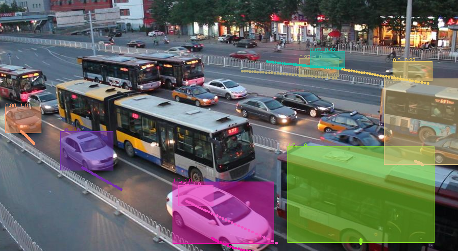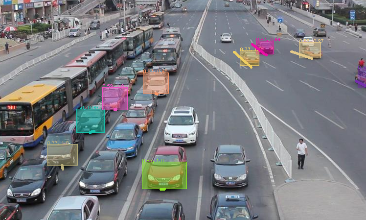 | :ballot_box_with_check: Cannot detect static vehicle (because of the training dataset)|
| 2019/05/18 | 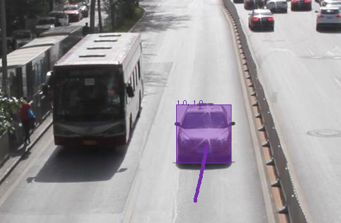 | :ballot_box_with_check: cannot detect bus （because of the training dataset) |
| 2019/05/18 | 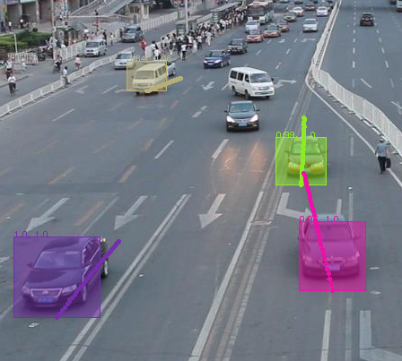 | :ballot_box_with_check: Limit on the detection regions |
| 2019/05/18 |  | :ballot_box_with_check: Something overlapped in the bus |
| 2019/05/18 | 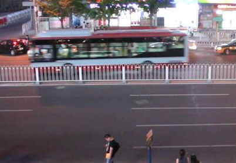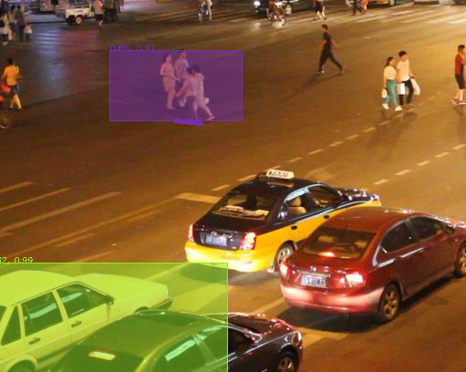 | :boom: totally different scene |
| 2019/05/18 | 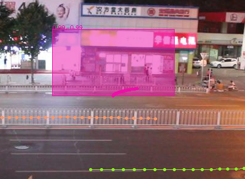 | :ballot_box_with_check: Some weird boxes (because of the visibility)|
| 2019/05/18 | 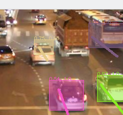 | :ballot_box_with_check: totally different vehicle |
| 2019/05/18 | 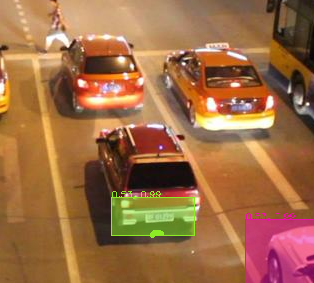 | :ballot_box_with_check: Wrongly located boxes |
| 2019/05/15 |  | :ballot_box_with_check: solved by change the loss according the first exist box <br />:boom: Weird rectangles and incorrect classifications |
| 2019/05/07 | None-filling rectangles <br /> | :ballot_box_with_check: waiting <br />:boom:2019/05/07 process |
| 2019/05/07 | Weird rectangles without label <br /> | :ballot_box_with_check: find the reason <br />:boom:2019/05/07 process |
| 2019/05/07 | Lost some objects in other scene <br />  | :ballot_box_with_check:finish by reconfigure the anchor boxes<br />:boom:2019/05/07 process |
| 2019/04/26 | Try MOT 17 | :ballot_box_with_check: Need to do (Finish) |
| 2019/04/26 | Train A-MOT Dataset | :ballot_box_with_check: Need to do (Finish) |
| 2019/04/26 | Train UA-DETRAC | :ballot_box_with_check: Training (Finish)|
| 2019/04/16 | Clean this project | :boom: Ready to do<br>:hourglass_flowing_sand: |
| 2019/04/16 | Overlap ratio of **Tunnel Anchor** too small | :ballot_box_with_check: Find the best overlap ratio​<br>:boom:<br>:hourglass_flowing_sand: |
| 2019/04/16 | Add **Random Mirror** Preprocessing | :no_entry:<br>:hourglass_flowing_sand: |
| 2019/04/16 | Add **Random Crop** Preprocessing | :no_entry:<br>:hourglass_flowing_sand: |
| 2019/04/16 | Needs Testing The Network | :ballot_box_with_check:Thoroughly testing see [result video](<https://www.dropbox.com/s/m63g9jotgs35xu5/1.avi?dl=0>)<br>:boom: 2019/04/16 processing |
| 2019/04/14 | Motion Model Needs Rewrite | :exclamation::exclamation::ballot_box_with_check: 2019/04/16 Rewriting motion model :)​<br>:boom: 2019/04/14 rewriting |
| 2019/04/13  | Lost some objects<br/> <br> |  :ballot_box_with_check: set confidence and existing threshold<br> :boom:20​19/04/13 process  |
| 2019/04/13  | NMS doesn't work well <br>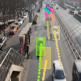 <br> | :ballot_box_with_check: ​the bad training data<br>2019/04/13 :boom: |
| 2019/04/13  | Problems of object at the edge of the frames. <br> 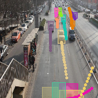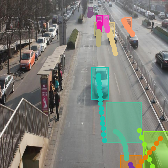 |   :ballot_box_with_check: ​remove edging boxes from training data<br>  2019/04/13 :boom:   |
| 2019/04/13  | Weird detected objects.<br>  |   :ballot_box_with_check: ​the motion model <br>2019/04/13 :boom:   |

> In our experiment, we find the missing bounding box is caused by the following code:
>
> ```python
> conf[mean_best_truth_overlap < threshold] = 0  # label as background
> ```
>
> Be careful to set this threshold.
